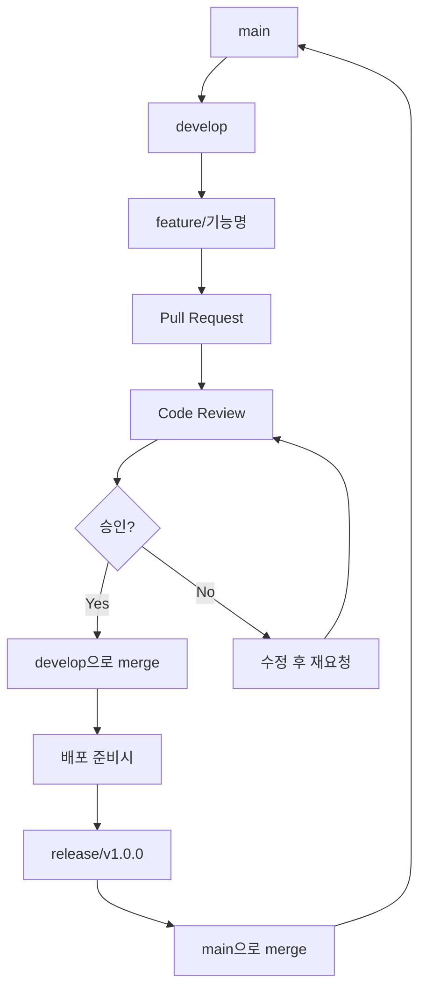

# 🌿 Gradi 프로젝트 GitHub 브랜치 전략

## 🎯 GitHub 브랜치 전략이 왜 필요한가요?

우리가 5명이서 같은 프로젝트를 개발할 때, 각자 다른 기능을 만들고 있다면:

- 정다훈이 로그인 화면을 만들고 있고
- 정성원이 데이터베이스 연결을 하고 있고
- 최예림이 AI 모델을 개발하고 있다면

이 모든 작업을 main 브랜치에서 동시에 하면 서로의 코드가 충돌하고 망가질 수 있어요! 😱

그래서 **각자 별도의 브랜치에서 작업한 후, 완료되면 합치는 방식**을 사용합니다.
이렇게 하면 안전하게 협업할 수 있어요! ✨

---

## 📋 브랜치 구조

### 🏠 메인 브랜치 (절대 직접 수정 금지!)

- **`main`** → 실제 서비스되는 완벽한 코드만 있는 곳
- **`develop`** → 개발 중인 기능들을 모아두는 곳

### 🔧 작업용 브랜치 (여기서 실제 개발!)

- **`feature/기능이름`** → 새로운 기능 개발할 때

  - 예시: `feature/login-page`, `feature/ai-model`

- **`hotfix/버그이름`** → 급하게 버그 고쳐야 할 때

  - 예시: `hotfix/login-error`

- **`release/버전`** → 배포 준비할 때
  - 예시: `release/v1.0.0`

### 👥 우리 팀 브랜치 네이밍 예시

```
🎨 프론트엔드
├── feature/frontend-login-page        # 정다훈
├── feature/frontend-main-dashboard    # 정다훈
├── feature/frontend-ui-design         # 최윤정

🔧 백엔드
├── feature/backend-user-auth          # 정성원
├── feature/backend-file-upload        # 정성원

🤖 AI
├── feature/ai-grading-model           # 최예림
├── feature/ai-feedback-system         # 민유진
```

---

## 📋 실제 작업 방법 (따라하세요!)

### 1️⃣ 새로운 기능 개발 시작

```bash
# 1. develop 브랜치로 이동
git checkout develop

# 2. 최신 코드 받아오기
git pull origin develop

# 3. 내 작업용 브랜치 만들기
git checkout -b feature/내가-만들-기능

# 예시: git checkout -b feature/login-page
```

### 2️⃣ 작업 완료 후 올리기

```bash
# 1. 변경사항 저장
git add .
git commit -m "feat: 로그인 페이지 완성"

# 2. GitHub에 올리기
git push origin feature/내가-만든-기능
```

### 3️⃣ Pull Request 만들기

1. GitHub 웹사이트 가서 "Compare & pull request" 버튼 클릭
2. 제목: 뭘 만들었는지 간단히 설명
3. 내용: 어떤 기능인지, 테스트는 했는지 설명
4. Reviewers에서 팀원 2명 이상 선택

### 4️⃣ 코드 리뷰

- 다른 팀원들이 내 코드 확인
- 문제없으면 "Approve" → merge 가능
- 문제있으면 수정 요청 → 수정 후 다시 올리기

---

## ✅ 커밋 메시지 규칙 (간단버전)

| 타입    | 설명                        | 예시                            |
| ------- | --------------------------- | ------------------------------- |
| `feat`  | 새로운 기능 추가했을 때     | `feat: 로그인 페이지 UI 완성`   |
| `fix`   | 버그 고쳤을 때              | `fix: 회원가입 버튼 오류 수정`  |
| `docs`  | 문서(README 등) 수정했을 때 | `docs: README에 설치 방법 추가` |
| `style` | 코드 정리만 했을 때         | `style: 들여쓰기 수정`          |

---

## 🚨 절대 하지 말아야 할 것들

- ❌ main 브랜치에 직접 push
- ❌ develop 브랜치에 직접 push
- ❌ 다른 사람 브랜치에 함부로 push
- ❌ 리뷰 없이 merge
- ❌ 테스트 안 하고 올리기

## ✅ 꼭 해야 할 것들

- ✅ 항상 feature 브랜치에서 작업
- ✅ Pull Request로만 코드 합치기
- ✅ 최소 2명한테 리뷰 받기
- ✅ 충돌나면 팀장한테 도움 요청

---

## 🆘 문제 생겼을 때

### 자주 생기는 문제들

- **Git 명령어 모르겠다** → 팀장한테 물어보기
- **브랜치 잘못 만들었다** → 삭제하고 다시 만들기
- **충돌(conflict) 났다** → 무리하지 말고 팀장 부르기
- **실수로 잘못 올렸다** → 당황하지 말고 즉시 알리기

### 📞 도움 요청 시 이렇게 말해주세요

**"[브랜치 이름]에서 [하려던 작업] 하다가 [어떤 에러] 났어요!"**

**예시:** "feature/login-page에서 push 하려는데 rejected 에러 났어요!"

---

## 📚 참고 자료

- [GitHub 공식 문서](https://docs.github.com/ko)
- [Git 기초 명령어](https://git-scm.com/docs)
- 팀 슬랙 채널: #gradi-dev
- 도움 요청: @정다훈

---

## 🔄 브랜치 플로우 요약



**💡 기억하세요: 혼자 할 수 없는 일은 없어요! 막히면 언제든 도움 요청하세요! 🙌**
